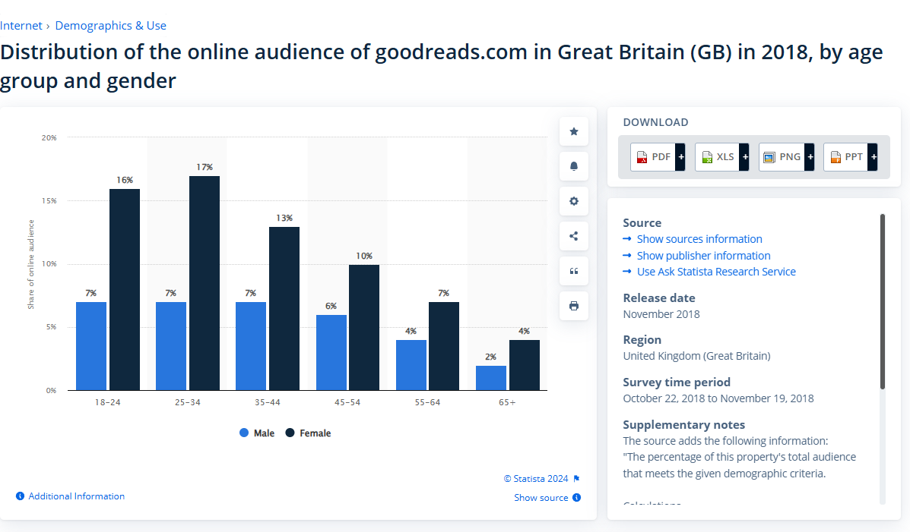

# Bound Project  

## Project Introduction  

### What is the concept and what are we building?  

We are building **Bound**, a collaborative decision-making app that provides book suggestions based on user input. The app’s key **‘bind’** feature allows two users to input their favourite books and receive a recommendation that merges their preferences.  

---

## Competitor research:  

### Fable  
This app allows users to join or start online book clubs, where members can read, discuss, and engage deeply with book selections. Fable has various clubs hosted by influencers, authors, and celebrities, offering a community-focused reading experience. Readers can track their progress, set reading goals, and explore curated lists within the app, making it easy to discover new books and participate in lively discussions. [Visit Fable](https://fable.co).  

### Goodreads  
A large social network for book lovers, featuring recommendations, ratings, reviews, and reading lists. [Visit Goodreads](https://www.goodreads.com).  

### StoryGraph  
Known for its mood-based recommendations and customisation options, StoryGraph provides a fresh alternative to Goodreads. [Visit StoryGraph](https://www.thestorygraph.com).  

### Bookly  
A popular reading tracker app, Bookly helps readers set goals, track their reading progress, and organise their reading habits. It features detailed statistics, customisable reading sessions, and reminders to help you stay on track with your reading goals. Bookly also offers a social component, allowing users to share their reading achievements with friends. [Visit Bookly](https://booklyapp.com).  

---

## Who will this help and what is our target audience?  

### Problem:  
Many book club members and friends want to find a book they will enjoy, but it can be challenging to combine different interests when considering factors such as genres, authors, and writing styles.  

### Solution:  
The app allows two (or more) members to join the app, make a profile, and invite others to share their favourite current books or previous reading lists. The app will find books that all members are expected to enjoy. We can then provide a space for those users to track their progress and set a start/end date for the book.  

### Demographics of those who use reading apps:  
- In the UK, 48% of people aged 12–15, 41% of people aged 16–24, 40% of people aged 25–34, and 41% of people aged 35–44 are high-frequency ebook consumers, according to [Statista](https://www.statista.com/statistics/291814/frequency-distribution-of-e-book-downloading-and-accessing-uk/). 
- According to a global survey, 56% of respondents were women, 42% were men, and 1% identified as other.  
- Millennials engage with books more than Gen X and baby boomers.  

### Our target audience still prefers print:  
To tailor our app to the larger market, we decided to make it so that once it finds a book for the user, they can be directed to [bookshop.org](https://uk.bookshop.org), where they can buy a paper version. Bookshop.org is an online bookshop that aims to support local bookshops. They have an affiliate programme which pays 10% for book recommendations.   

---

## How will we be working and what tools will help with that?  

### Frontend:  
- **Figma** for wireframes to outline UX/UI designs.  
- **React (Vite/Native)** and **JavaScript** to build interactive pages.  
- Components that fetch and display book images, ratings, and details.  

### Backend:  
- **Node.js** for the server-side APIs: we may want to use Google Books API, NYT Books API, and Amazon API.  
- **Database**: SQL to store book data.  

### Security:  
- To authorise users.  

### Communication:  
- **Slack**  
- **Gather**  

### Miscellaneous:  
- **GitHub**  
- **Visual Studio Code**  

---

## How are we going to organise the workload? Who does what and when?  

We will use a range of methods to divide tasks within our workload:  
- Regular check-ins to ensure we are on track to reach our goal.  
- Update our **Activity Log** to track our progress and tasks.  
- Prioritise tasks using the **MoSCoW method** (Must have, Should have, Could have, Will not have).  
- **Pair programming**.  
- Create a **to-do list** and split responsibilities.  
- Follow the **Agile method**.  

---

## What are the main features of the product?  

### User Profiles  
- **User Login/Signup**: Secure login/signup functionality with email.  
- **Profile Setup**: Users create a profile including their name, avatar, and reading preferences.  
- **Personal Library**: Users can add books they've read, are currently reading, or wish to read.  
- **Invite Friends**: Ability to invite friends or book club members to join the app for collaborative book discovery.  
- **Book Club Page**: Space to create a book club, provide a name, and invite users, showing the current book and start/end date for the book.  

### Book Discovery & Recommendations  
- **Public API Integration**: Use APIs such as:  
  - **Google Books API**: Provides book images, descriptions, author information, and ratings.  
  - **New York Times Books API**: Fetches data about current NYT bestsellers. (Do we want to include other “awards” such as the Women’s Prize for Fiction?)  
  - **Amazon Product Advertising API**: Provides links to purchase books directly on Amazon. (*Affiliate marketing opportunity £££!*)  
- **Book Images & Ratings**: Display book covers, average ratings, and detailed reviews.  
- **Book Details**: Include author information, publication year, and short summaries.  
- **Bestseller Status**: Highlight if a book is a current or past NYT bestseller.  
- **Book Quiz**: To help decide what book to read next, take a quiz on what genres you like, interests, topics, fiction/non-fiction, mood you're in, and length of the book.  
- **Voting**: Allow users to vote on suggested books to help the group make a decision.  

### User Input  
- **Input Past Reads**: Users can manually enter or import data about books they have read, liked, or disliked. (If we import, it may be hard as a lot of people use Goodreads and they have closed their public API).  
- **Top Picks**: Users can list their top current books, and the app will find overlaps or suggest similar books.  

### Recommendations Algorithm  
- **Mutual Book Suggestions**: Using algorithms, the app will suggest books that match shared genres or topics based on combined user preferences.  

---

## Summary for design choices:  
- Light text on a dark background to enhance accessibility. The light-coloured text on the dark background was chosen for high contrast, and the colours are reminiscent of dark academia.  
- The ability to zoom in/change font sizes to ensure accessibility for all.  
- Images will have descriptions for accessibility.  
- The design will follow a **Z pattern** to maximise readability.  
- The website will be **responsive** to whatever device is being used to view it.
