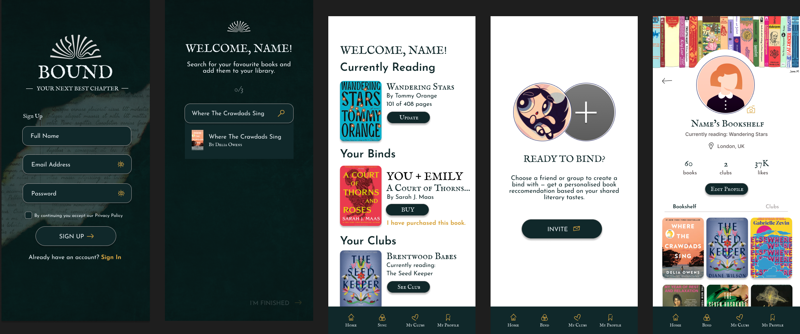

### Bound Wireframes

**Minimum target:**  

We broke down our project into the minimum number of screens required for the assignment and organised them as follows:  

  
[View Condensed Project on Figma](https://www.figma.com/design/fTSkVwgbchv6kLd4ooIGS5/Bound?node-id=92-306&node-type=canvas&t=uhKT5WeLWl3ckltw-0).  

**Detailed Wireframe Breakdown**

- **Page 1, Sign In:**  
  This is the sign-up screen users see when they first download the app. They are prompted to enter their full name, email, and password to create a unique login. This information is securely stored in a database.  

- **Page 2, Book Selection:**  
  Users can add books they have enjoyed on this screen. Additional book details, such as genre, will be retrieved from an API and used by the algorithm to suggest similar books. This screen follows a 'Z' design pattern, guiding attention from the title to the book image and then to the book title.  

- **Page 3, Home Screen:**  
  The home page displays various information, including books currently logged by the user, a book matched with another app user, and book clubs joined by the user.  

- **Page 4, Bind Invite:**  
  'Binding' is a feature where two friends are recommended a book by the algorithm. This recommendation is based on shared preferences and books both users have input into the app.  

- **Page 5, Profile:**  
  The user's profile displays books currently being read, books previously read, and book clubs they have joined. This profile is also visible to other users.  

**Ideal target:**  

If time allows, we aim to achieve the full project scope as shown:  

  
[View Full Target Project on Figma](https://www.figma.com/design/41eQ9XZkK6JrLddVItQLba/Bound?node-id=0-1&node-type=canvas&t=SYvWmDQ9XNxJSgH8-0).  
